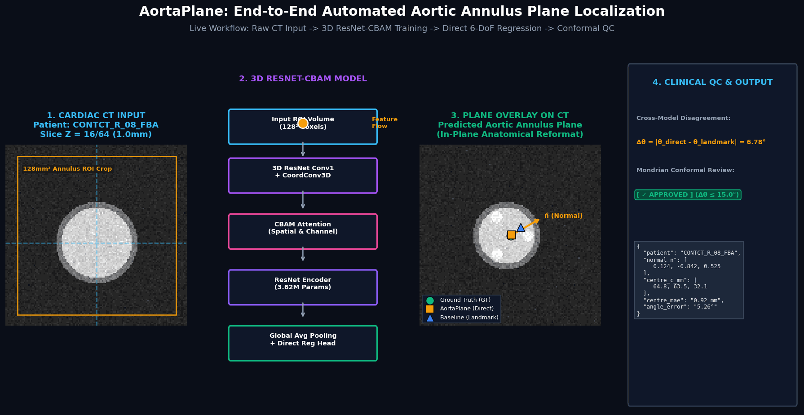

# AortaPlane

Author: Vandhanaa Natarajan Chitra, Emil Gasimov, Laura Bevis, Fuyu Cheng, Elisa Rauseo, Yousaf Bhatti, Khushi Satish Hiremath, Hsu Hlaing Hnin, Caroline Roney, Anthony Mathur, Gregory Slabaugh, and Xu Chen. 


### Deep Learning-Based Aortic Annulus Plane Detection from 3D Cardiac CT for TAVI Planning



[](Docs/AortaPlane.pdf)
[](Docs/Usage%20and%20Setup)
[](Docs/Directory)
[](#data-availability)

AortaPlane **regresses the aortic annulus plane directly from 3D cardiac CT, compares it against a landmark-based pipeline, and flags unreliable predictions for expert review.**

---

## Highlights

- **Direct 6-DoF regression:** a 3D ResNet-CBAM encoder predicts the plane centre and unit normal in one step, with no intermediate landmark or segmentation stage.
- **Controlled comparison:** direct regression vs a U-Net landmark-heatmap model, under identical preprocessing, training, and leak-free 5-fold cross-validation on a heterogeneous four-protocol dataset.
- **nnLandmark encoder swap:** the final model (AortaPlane + nnLandmark backbone) reaches **3.07 mm centre MAE / 13.08° angular error** (5-fold CV, n = 37) and **3.17 mm / 15.79°** on 5 patients never used in training or tuning, at roughly 24× the parameters of native AortaPlane.
- **Quality control without ground truth:** disagreement between independently trained models is used as a Mondrian split-conformal review trigger (ρ = 0.358, p = 0.0297, n = 37).
- **Negative and null results are reported:** CoordConv (null), test-time augmentation (angle worsens), and one round of pseudo-labelling (worse) are all documented.

## 1. What is the aortic annulus plane?

Transcatheter Aortic Valve Implantation (TAVI) is a less invasive alternative to open-heart aortic valve replacement for severe aortic stenosis. Valve sizing and placement depend on the **annulus plane**: the geometric plane through the three basal attachment points of the **right coronary (RC), non-coronary (NC), and left coronary (LC)** cusps. Errors of a few degrees or millimetres raise the risk of paravalvular leak, coronary occlusion, or conduction disturbance requiring a permanent pacemaker (Bianchini et al., 2024; Bhushan et al., 2022; full references in the [paper](docs/AortaPlane_Dissertation.pdf)).

Today the plane is placed manually on multi-planar CT reconstructions ([Blanke et al., 2019](https://doi.org/10.1016/j.jcmg.2018.01.020)), which is slow and subject to inter-observer variability.

## 2. What are we predicting?

The plane is represented as a **centre point** `c` (the centre of mass of the three cusp points) and a **unit normal** `n` (the cross product of two cusp-to-cusp vectors). The loss is sign-invariant, since `n` and `−n` describe the same plane:

```
L = λn · (1 − |n̂ · n|) + λc · ‖ĉ − c‖²
```

## 3. The models

Both approaches are evaluated with 5-fold cross-validation on a 42-patient, four-cohort dataset (Dongyang / KiTS / Rider / CONTCT\_R) with 5 patients held out as a locked test set. Both share the same 3D encoder; only the output head and decoding differ.

- **M1 — AortaPlane (AnnulusPlaneNet):** direct 6D regression (plane centre +
  normal) via a 3D ResNet18 backbone with CBAM attention
  ([He et al., 2016](https://arxiv.org/abs/1512.03385); [Woo et al., 2018](https://arxiv.org/abs/1807.06521)).
- **M2 — Baseline (AnnulusLandmarkNet):** landmark heatmap regression over the
  right/non/left coronary cusps (RC/NC/LC), with the plane derived
  geometrically from the predicted landmarks, using a U-Net-style decoder with soft-argmax
  ([Ronneberger et al., 2015](https://arxiv.org/abs/1505.04597); [Çiçek et al., 2016](https://arxiv.org/abs/1606.06650)).

  


Both models are additionally benchmarked against a
fine-tuned nnU-Net-derived landmark baseline (**nnLandmark**) under three
fine-tuning strategies (frozen encoder, partial unfreeze, differential
learning rate). The nnLandmark encoder (`PlainConvEncoder`, InstanceNorm3d, LeakyReLU, channels 32–320) is also transplanted into both pipelines
as a drop-in encoder replacement ([nnU-Net, Isensee et al., 2021](https://doi.org/10.1038/s41592-020-01008-z); [MIC-DKFZ/nnLandmark](https://github.com/MIC-DKFZ/nnLandmark)).

Extensions studied: **CoordConv3D** ([Liu et al., 2018](https://arxiv.org/abs/1807.03247)), test-time augmentation, and input resolution (64³ vs 128³).

## 4. How AortaPlane works end to end

1. **Preprocess:** resample to 1.0 mm isotropic, convert landmarks to voxel space, apply cohort-specific intensity handling, crop a fixed 128 mm field of view around the annulus, and resample to 64³ or 128³.
2. **Train:** 5-fold cross-validation on 37 patients; Adam, mixed precision, early stopping (patience 60, up to 300 epochs).
3. **Infer:** the five fold checkpoints are ensembled (mean = point estimate).
4. **Quality control:** two independently trained models are compared per patient. Large disagreement triggers expert review, with a conformal bound on the worse model's angular error.

See the [flowchart above](aortaplane-ct-training-pipeline.gif) for the full pipeline.

## 5. How the data is preprocessed

- **Cohort-specific intensity handling:** HU windowing for CONTCT\_R, Dongyang, and Rider; percentile clipping for the 12-bit KiTS cohort (a single HU window would have clipped 50–80% of its voxels); −2000 background padding handled for Rider.
- **Annotations:** RC/NC/LC landmarks on the AVT subsets were annotated manually in [3D Slicer](https://www.slicer.org/) following the clinical protocol of [Blanke et al. (2019)](https://doi.org/10.1016/j.jcmg.2018.01.020). CONTCT\_R segmentations and landmarks were created manually from full-body angiograms.
- **Coordinates:** image-voxel to physical (mm) to target-volume voxels, with explicit LPS/RAS handling (SimpleITK).


## 7. Cross-model disagreement as a review signal

- **Within-model fold disagreement** (std across a model's own 5 checkpoints) did not track its own error: ρ = −0.100 (p = 0.87) for AortaPlane; ρ = 0.800 (p = 0.10, not significant at n = 5) for Baseline.
- **Cross-model disagreement** (AortaPlane vs Baseline, single held-out fold per patient) correlates modestly with the *worse* model's error: ρ = 0.358, p = 0.0297. It does **not** predict AortaPlane's own error (ρ = −0.124, p = 0.47). Part of this correlation is expected by construction (angular triangle inequality).
- It is therefore used as a **symmetric trigger**: when the two models disagree substantially, at least one is likely wrong, regardless of which.
- **Mondrian split-conformal bound**, conditioned on a 15° disagreement group: low-disagreement group (n = 32) has a calibrated worst-model error bound of ≤ 19.08° at 90% coverage; high-disagreement group (n = 5) has ≤ 45.57° at 80% coverage (90% is not achievable at this sample size). Leave-one-out coverage matched nominal targets.

Threshold sweep (n = 37; thresholds selected and evaluated on the same set, so descriptive only):

| "Bad" defined as | Threshold | Flagged | TP | Precision | Recall / F1 |
| ---------------- | --------- | ------- | -- | --------- | ----------- |
| error > 10°      | 0.40°     | 36      | 27 | 0.75      | 0.96 / 0.84 |
| error > 15°      | 7.96°     | 17      | 13 | 0.76      | 0.77 / 0.76 |
| error > 20°      | 15.51°    | 4       | 4  | 1.00      | 0.57 / 0.73 |

## 8. Limitations and negative results

- **Small test set:** the held-out set is n = 5; the n = 5 block is indicative only.
- **Crop anchoring:** the 128 mm field of view is placed from an initial centre estimate. If that estimate is off by more than half the crop width, the annulus falls outside the volume and no model can recover it.
- **nnLandmark two-patient failure:** angular errors for both nnLandmark variants concentrate on the same two test patients, traced to scan-spacing distribution shift (one with ~5 mm axial spacing; one with over 1000 slices at 0.625 mm). Coordinate-handling and annotation errors were ruled out (paper, Appendix A).
- **Pseudo-labelling (negative result):** one iteration of semi-supervised pseudo-labelling was slightly worse on every metric (pooled CV centre error 2.53 → 2.63 mm; test-set centre error 1.99 → 2.72 mm) (paper, Appendix B).
- **Parameter cost:** the nnLandmark-encoder models are ~24× larger than native AortaPlane.
- **Gating validation:** thresholds are tuned and evaluated on the same cohort; prospective validation on an independent cohort is future work.

---


## Data availability

This project used 42 patients across four cohorts (37 for 5-fold cross-validation, 5 held out for testing):

| Cohort            | Patients | CV / Test | Access                                                                                                                                                                                  |
| ----------------- | -------- | --------- | --------------------------------------------------------------------------------------------------------------------------------------------------------------------------------------- |
| CONTCT\_R         | 20       | 18 / 2    | Not distributed. Retrospective, de-identified TAVI cases from Barts Health NHS Trust, used under DERI's data-sharing agreement.                                                          |
| D (Dongyang)      | 10       | 9 / 1     | Public AVT subset: [AVT release](https://figshare.com/articles/dataset/Aortic_Vessel_Tree_AVT_CTA_Datasets_and_Segmentations/14806362) / [SEG.A.](https://multicenteraorta.grand-challenge.org/). Our landmark annotations are not redistributed. |
| K (KiTS)          | 6        | 5 / 1     | Public AVT subset (12-bit, non-HU; percentile clipping). Same release as above. Our landmark annotations are not redistributed.                                                          |
| R (Rider)         | 6        | 5 / 1     | Public AVT subset (HU, −2000 background padding). Same release as above. Our landmark annotations are not redistributed.                                                                 |

In detail:

- **Barts Health NHS Trust cohort (CONTCT\_R, n=20).** Retrospective,
  de-identified TAVI case data, used under DERI's data-sharing agreement with
  Barts Health NHS Trust. This data cannot be redistributed as part of a
  student submission; it is not included in this archive.
- **AVT dataset cohorts (D/K/R, n=22).** Publicly available multicentre CTA
  data ([Radl et al., 2022](https://doi.org/10.1016/j.dib.2021.107801)); this project's own manual landmark annotations on
  a subset of these scans are also not redistributed here, but the underlying
  public imaging data can be obtained from the AVT dataset's own public
  release.

---

**Steps to run the code**, given access to equivalent data and a
CUDA-capable machine:

1. Set up the environment(s) as above.
2. Obtain/place patient data under the path expected by `dataset.py` /
   `convert_annulus.py` (see comments in those files for the expected
   directory layout).
3. Run `train_m1_variants.py` / `train_m2_variants.py` with the desired
   `--fold` argument (0–4) to train the native models or a named variant, or
   use the SLURM scripts under `slurm_scripts/` directly (these show the
   exact arguments used for the reported results).
4. Alternatively, load the provided checkpoints directly for inference
   without retraining: `checkpoints/M1_fold0_best_weights_only.pth` /
   `checkpoints/M2_fold0_best.pth`, using
   `AnnulusPlaneNet(dropout_p=0.3, use_se=False, use_cbam=True)` /
   `AnnulusLandmarkNet(dropout_p=0.3, use_cbam=True)` from `src/model.py`
   respectively.
5. Run `evaluation/eval_cv.py` or
   `evaluation/compute_full_grid_5fold_true_test.py` to reproduce the
   evaluation tables reported in the dissertation.
6. For the nnLandmark comparison: run `convert_annulus.py` to build the
   nnLandmark-format dataset, then use nnLandmark's own CLI
   (`nnLM_extract_fingerprint`, `nnLM_plan_experiment`, `nnLM_train`) with the
   custom trainer classes provided under `nnlandmark_comparison/training/`,
   or the SLURM scripts under `slurm_scripts/` directly.

---

## SLURM scripts not included

`nnlandmark_comparison/` contains a number of additional launch scripts
beyond those in `slurm_scripts/` (e.g. `train_dataset741*.sh` variants,
`retrain_v1_matched.sh`, `submit_semi_supervised_live.sh`). These were
earlier, superseded, or exploratory runs (confirmed via file timestamps and
by checking which scripts actually launch the code paths behind reported
results) and are not included, to keep the submission focused on the scripts
that actually produced the numbers in the dissertation.

## Third-party code not included

This project builds on MIC-DKFZ's [nnU-Net](https://github.com/MIC-DKFZ/nnUNet) framework (via a locally installed
[`nnLandmark`](https://github.com/MIC-DKFZ/nnLandmark) package derived from it) for the nnLandmark comparison arm of
the project. Only the code specific to this project is included in this
archive — namely `finetune_strategies.py` (the three fine-tuning-strategy
trainer subclasses) and the dataset-conversion/split-building scripts listed
above. The underlying nnU-Net/nnLandmark library itself (stock trainer
classes, base architecture code, plans files, etc.) is not included, since it
is unmodified third-party code installable via its own public package rather
than project deliverable code.

---

## Known issues (disclosed for transparency)

- **`compute_nnlandmark_native_flops.py`**: the freshly-instantiated model in
  this script has ~30.8M parameters, but the actual trained checkpoint has
  ~88.2M — the architecture configuration in this script does not match what
  was actually trained. Its FLOPs output should not be relied upon without
  further debugging.
- **Parameter/FLOPs double-counting for the two nnLandmark-transplant
  variants** (`M1_nnLandmark`, `M2_nnLandmark`): these models' encoder blocks
  (from the `dynamic_network_architectures` package) expose the same
  underlying conv/norm layers via two attribute paths (`.conv`/`.norm` and
  `.all_modules`) for introspection purposes. Naive parameter/FLOPs counting
  tools that don't deduplicate by object identity (including `thop`, as used
  in earlier profiling) will double-count these layers. The true,
  deduplicated parameter counts are 14,046,054 (AortaPlane+nnLandmark) and
  31,196,399 (Baseline+nnLandmark); a fully corrected FLOPs figure was still
  being worked out as of this submission.

---

## Citation

If you use AortaPlane in your research, please cite our [paper](Docs/AortaPlane.pdf):

```
@mastersthesis{natarajanchitra_aortaplane,
  title  = {{AortaPlane}: A Deep Learning Framework for Aortic Annulus Plane Localisation},
  author = {Natarajan Chitra, Vandhanaa},
  school = {Queen Mary University of London},
  type   = {MSc project dissertation},
  year   = {2026},
  note   = {Supervisor: Dr Xu Chen}
}
```

Venue and DOI will be added if the work is published.

## Acknowledgements

We thank the developers of [nnU-Net / nnLandmark](https://github.com/MIC-DKFZ/nnLandmark) and [3D Slicer](https://www.slicer.org/) for the tools supporting this work. We also acknowledge the authors and data contributors of AVT / SEG.A. ([Radl et al., 2022](https://doi.org/10.1016/j.dib.2021.107801); [Pepe et al., 2024](https://multicenteraorta.grand-challenge.org/)), and Barts Health NHS Trust for the CONTCT\_R cohort, used under DERI's data-sharing agreement.

Supervision: Dr Xu Chen, QMUL. Model training used Queen Mary University of London's [Apocrita high performance computing cluster](https://doi.org/10.5281/zenodo.438045).

Use of generative AI tools in this project (debugging, table formatting, and language editing) is declared in Appendix C of the paper.

## Selected references

The following references support the methods, datasets, and computing resources discussed above. The [paper](docs/AortaPlane_Dissertation.pdf) contains the full bibliography.

- **nnU-Net:** Isensee et al. *nnU-Net: a self-configuring method for deep learning-based biomedical image segmentation.* Nature Methods, 18(2):203–211, 2021. [Publication](https://doi.org/10.1038/s41592-020-01008-z).
- **ResNet:** He et al. *Deep residual learning for image recognition.* CVPR 2016, pp. 770–778. [Paper](https://arxiv.org/abs/1512.03385).
- **CBAM:** Woo et al. *CBAM: Convolutional block attention module.* ECCV 2018, pp. 3–19. [Paper](https://arxiv.org/abs/1807.06521).
- **U-Net:** Ronneberger et al. *U-Net: Convolutional networks for biomedical image segmentation.* MICCAI 2015, pp. 234–241. [Paper](https://arxiv.org/abs/1505.04597).
- **3D U-Net:** Çiçek et al. *3D U-Net: Learning dense volumetric segmentation from sparse annotation.* MICCAI 2016, pp. 424–432. [Paper](https://arxiv.org/abs/1606.06650).
- **CoordConv:** Liu et al. *An intriguing failing of convolutional neural networks and the CoordConv solution.* NeurIPS 2018, 31, pp. 9605–9616. [Paper](https://arxiv.org/abs/1807.03247).
- **Conformal prediction:** Angelopoulos and Bates. *A gentle introduction to conformal prediction and distribution-free uncertainty quantification.* 2021. [Paper](https://arxiv.org/abs/2107.07511). See also Vovk, Gammerman, and Shafer. *Algorithmic Learning in a Random World.* Springer, 2005.
- **AVT / SEG.A.:** Radl et al. *AVT: Multicenter aortic vessel tree CTA dataset collection with ground truth segmentation masks.* Data in Brief, 40, 107801, 2022. [Dataset](https://figshare.com/articles/dataset/Aortic_Vessel_Tree_AVT_CTA_Datasets_and_Segmentations/14806362).
- **SEG.A. 2023:** Pepe, Melito, and Egger (eds.). *Segmentation of the Aorta. Towards the Automatic Segmentation, Modeling, and Meshing of the Aortic Vessel Tree from Multicenter Acquisition.* LNCS 14539, Springer, 2024. [Challenge](https://multicenteraorta.grand-challenge.org/).
- **CT guidance for TAVI:** Blanke et al. *Computed tomography imaging in the context of transcatheter aortic valve implantation (TAVI)/transcatheter aortic valve replacement (TAVR): an expert consensus document of the Society of Cardiovascular Computed Tomography.* JACC: Cardiovascular Imaging, 12(1):1–24, 2019. [Publication](https://doi.org/10.1016/j.jcmg.2018.01.020).
- **ADPANet:** Cho et al. *Aortic annulus detection based on deep learning for transcatheter aortic valve replacement using cardiac computed tomography.* Journal of Korean Medical Science, 38(37):e306, 2023. [Publication](https://doi.org/10.3346/jkms.2023.38.e306).
- **Annular plane and coronary ostia:** Astudillo et al. *Automatic detection of the aortic annular plane and coronary ostia from multidetector computed tomography.* Journal of Interventional Cardiology, 2020:9843275. [Publication](https://doi.org/10.1155/2020/9843275).
- **Aortic root morphology:** Saitta et al. *A CT-based deep learning system for automatic assessment of aortic root morphology for TAVI planning.* Computers in Biology and Medicine, 163:107147, 2023. [Publication](https://doi.org/10.1016/j.compbiomed.2023.107147).
- **Pre-TAVR assessment:** Wang et al. *Development and validation of a deep learning-based fully automated algorithm for pre-TAVR CT assessment of the aortic valvular complex and detection of anatomical risk factors: a retrospective, multicentre study.* eBioMedicine, 95:104794, 2023. [Publication](https://doi.org/10.1016/j.ebiom.2023.104794).
- **Apocrita:** King, Butcher, and Zalewski. *Apocrita — High Performance Computing Cluster for Queen Mary University of London.* 2017. [Record](https://doi.org/10.5281/zenodo.438045).
